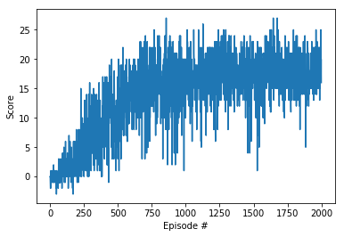
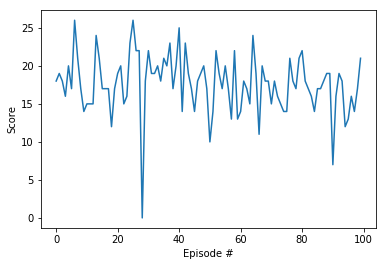

# Udacity Deep Reinforcement Learning Nanodegree Program
## Project 1, Navigation

# Vidoes
## Before Training
[](https://www.youtube.com/watch?v=OE8RaLkGxr8)

## After Training
[](https://www.youtube.com/watch?v=3S2NPQ858aY)


# The Environment

A reward of +1 is provided for collecting a yellow banana, and a reward of -1 is provided for collecting a blue banana. Thus, the goal of your agent is to collect as many yellow bananas as possible while avoiding blue bananas.

The state space has 37 dimensions and contains the agent's velocity, along with ray-based perception of objects around the agent's forward direction. 5 dimensions of ray-based perception of objects around the agent’s forward direction (Each ray is [Yellow Banana, Wall, Blue Banana, Agent, Distance]) and 2 dimensions of velocity (forward/backward , left/right)
Given this information, the agent has to learn how to best select actions. Four discrete actions are available, corresponding to:

0 - move forward.
1 - move backward.
2 - turn left.
3 - turn right.
The task is episodic, and in order to solve the environment, **the agent must get an average score of +13 over 100 consecutive episodes**.

# How to run the code
* Download or clone this repository and then:
## Option 1 - Build and run the docker under the "Docker" folder
* Build with `build_docker.sh`
* Run with `run_docker.sh`
* Open notebook at http://127.0.0.1:5555/notebooks/deep-reinforcement-learning/p1_navigation/Navigation.ipynb
* Run notebook
## Option 2 - run the .ipynb file on your computer 
* Follow instruction at lesson 4 on the navigation project
* Copy all the files in this repository under `p1_navigation` folder
* Run jupyter-notebook and open `Navigation.ipynb`
* Install missing libraries if needed - pytorch, unity, numpy, matplotlib, collection
* Run notebook

* Notebook high-levels parameters (found at the first cell):
```
TRAIN = False # Perform training stage
TRAINED_FILENAME='./checkpoint.pth' # these weights will be used for the test part
TEST = True # Perform testing stage
VIS = True # Show vis
VIS_TEST_SLOW = False # Show vis at ~10FPS at testing phase 
TRAIN_EPISODES = 2000
TEST_EPISODES = 100
```


# Report
## Definitions
### State and action space:
```
Unity brain name: BananaBrain
        Vector Observation space size (per agent): 37
        Vector Action space size (per agent): 4
```
### agent:

```
agent = Agent(state_size=37, action_size=4, seed=0)
BUFFER_SIZE = int(1e6)  # replay buffer size
BATCH_SIZE = 64         # minibatch size
GAMMA = 0.99            # discount factor
TAU = 1e-3              # for soft update of target parameters
LR = 0.001              # **INITIAL** learning rate 
UPDATE_EVERY = 4        # how often to update the network

```

### Network:
```
    def forward(self, state):
        """Build a network that maps state -> action values."""
        x = F.relu(self.fc1(state))
        x = F.dropout(x,p=0.1)
        x = F.relu(self.fc2(x))
        x = F.dropout(x,p=0.1)
        x = F.relu(self.fc3(x))
        return self.fc4(x)
```

* fc1: Linear with 37 inputs to 100 outputs
* fc2: Linear with 100 inputs to 100 outputs
* fc3: Linear with 100 inputs to 50 outputs
* fc4: Linear with 50 inputs to 4 outputs
* Dropout with probability of 0.1 after fc1 and fc2

### Learning phase:
```
n_episodes=2000
max_t=1000
eps_start=1.0
eps_end=0.01
eps_decay=0.995
scheduler = torch.optim.lr_scheduler.StepLR(agent.optimizer, step_size=750, gamma=0.05)
```
* The learning rate starts from 0.001 and drops to 5% of its value every 750 episodes

## Algorithm description and results
The network, agent and learning phase were based on the DQN example from the course. 

### Netowrk:
The network final architecture was as described in the definitions. Different networks were tested with lower results, such as:
* Using only 3 fc layers
* Using 100 units at the 4th stage
* Using dropout of 0.4-0.5

### Agent:
Double DQN was implemented such that during the learning the Q values are taken from the target network, however not from the maximum action in the target network but from the maximum action index of the local network
```
act_next_local = self.qnetwork_local(next_states).detach().max(1)[1].unsqueeze(1)
Q_targets_next = self.qnetwork_target(next_states).detach().gather(1, act_next_local) 
```
The final agent parameters were as described in the definitions. Different parameters were tested with lower results, such as:
* Reducing Gamma to 0.9
* Increasing Tau to 1e-2
* Reducing and Increasing the learning rate (The chosen learning rate was a dynamic one)


### Learning Phase:
The phase consist of 2000 episodes. A higher number was tested but with no increase of the score.
The learning rate was changed during the phase:
* Init - 0.001
* After 750 episodes - 5e-05
* After 1500 episodes - 2.5e-06

This phase with the selected parameters yield the next output:
```
Changing lr from  0  to:  0.001
Episode 100	Average Score: 0.14
Episode 200	Average Score: 2.11
Episode 300	Average Score: 5.23
Episode 400	Average Score: 7.45
Episode 500	Average Score: 10.48
Episode 600	Average Score: 12.97
Episode 700	Average Score: 14.61
Saving...
Episode 750	Average Score: 15.09
Changing lr from  0.001  to:  5e-05
Episode 800	Average Score: 15.57
Saving...
Episode 900	Average Score: 16.36
Saving...
Episode 1000	Average Score: 15.70
Episode 1100	Average Score: 17.06
Saving...
Episode 1200	Average Score: 17.17
Saving...
Episode 1300	Average Score: 17.79
Saving...
Episode 1400	Average Score: 17.62
Episode 1500	Average Score: 17.27

Changing lr from  5e-05  to:  2.5000000000000006e-06
Episode 1600	Average Score: 17.17
Episode 1700	Average Score: 18.17
Saving...
Episode 1800	Average Score: 17.57
Episode 1900	Average Score: 17.63
Episode 2000	Average Score: 18.06
```



### Test Phase:
At this phase the network only evaluate the predicted action at a given state.
For this phase network with the weights after 1700 episodes were used.
This phase yields and average score of 17.62 - **Meaning the agent was able to receive an average reward (over 100 episodes) of at least +13**. It is most likely that using the trained network after 700 episodes was enough already to achieve this goal.




## Ideas for future work

* Implement Prioritized Experience Replay 
* Implement Dueling DQN
* Testing more complex network architecture, also on the visual input of the game
* Changing the reward system and understanding how it affect the training
* Make more hyperparameter testing, in particular changing some parameters (GAMMA, TAU) to dynamic parameters
